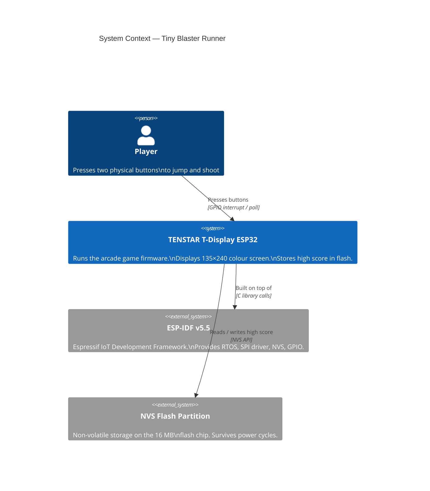
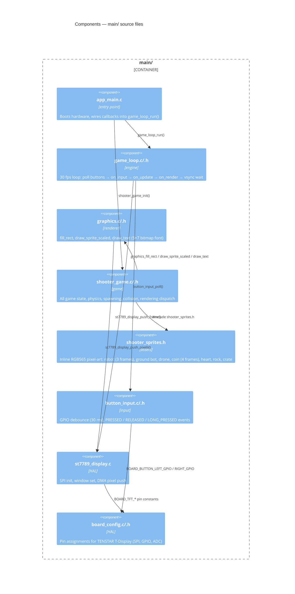
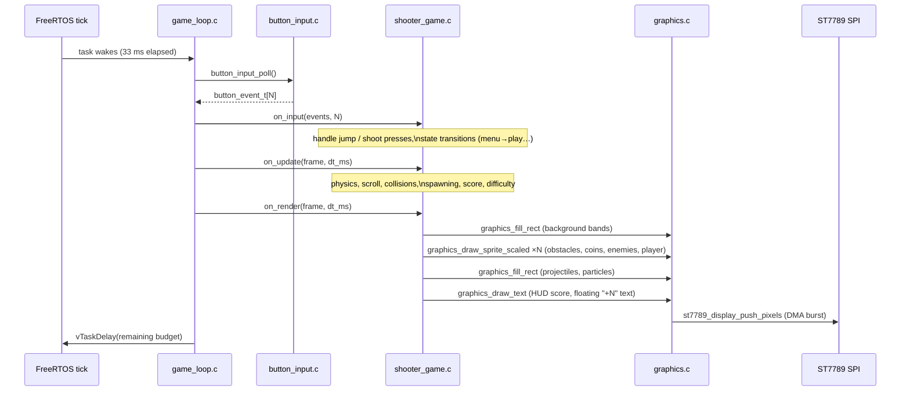
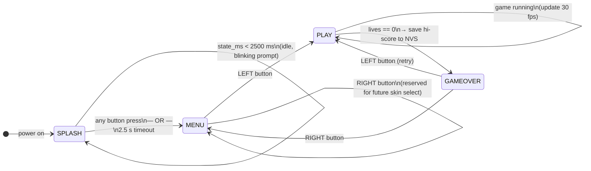
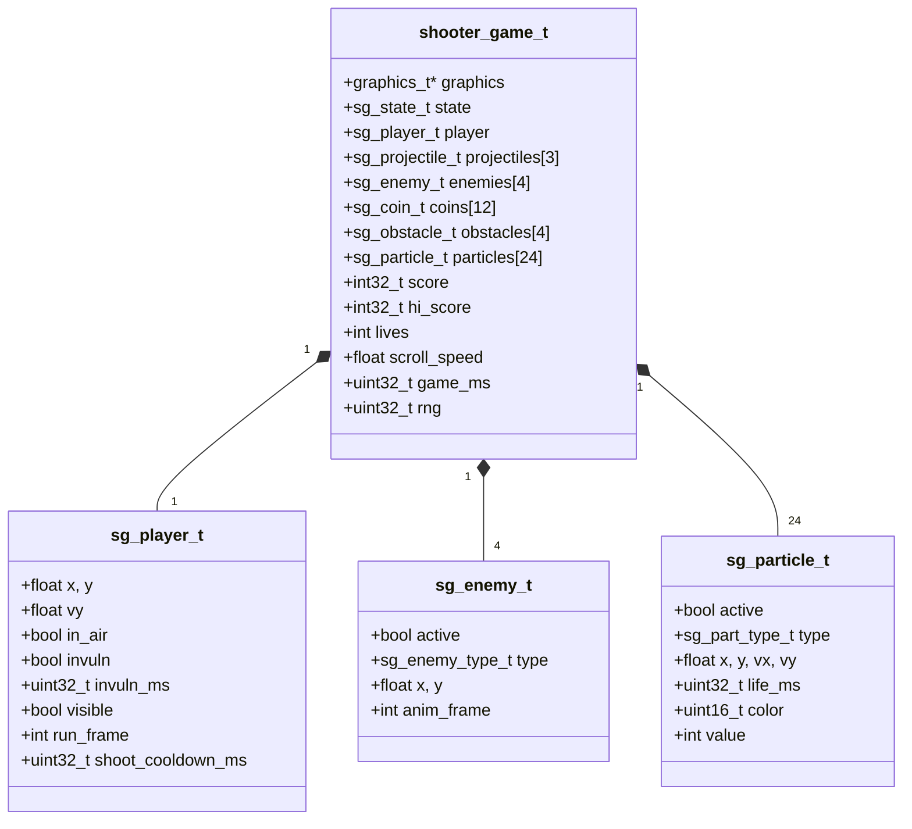
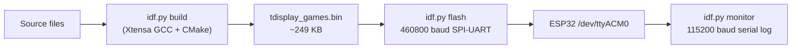

# Tiny Blaster Runner — Architecture

> C4 model documentation for the ESP32 arcade firmware.  
> Diagrams use [Mermaid](https://mermaid.js.org/) syntax, rendered by GitHub, GitLab, and most modern Markdown viewers.

---

## Level 1 — System Context

Who uses the system and what external systems does it talk to?



---

## Level 2 — Container Diagram

The firmware is a single binary. Logically it is split into four layers:

```mermaid
C4Container
    title Containers — Firmware Layers

    Person(player, "Player")

    Container_Boundary(fw, "ESP32 Firmware (tdisplay_games.elf)") {
        Container(hal,      "Hardware Abstraction",  "C / ESP-IDF drivers",  "ST7789 display SPI, GPIO button debounce, board pin constants")
        Container(engine,   "Game Engine",           "C",                    "Game loop (30 fps target), graphics primitives, sprite renderer")
        Container(game,     "Game Logic",            "C",                    "Tiny Blaster Runner — all gameplay, physics, spawning, scoring")
        Container(persist,  "Persistence",           "NVS",                  "High-score read/write across power cycles")
    }

    Rel(player,   hal,     "Button presses",         "GPIO")
    Rel(hal,      engine,  "button_event_t stream",  "poll / callback")
    Rel(engine,   game,    "on_input / on_update\non_render callbacks", "function pointers")
    Rel(game,     engine,  "graphics_* API calls",   "fill_rect, draw_sprite…")
    Rel(engine,   hal,     "pixel data",             "SPI DMA → ST7789")
    Rel(game,     persist, "nvs_get_u32 / set_u32",  "NVS namespace \"tbr\"")
```

---

## Level 3 — Component Diagram

Each source file is a component. Arrows show compile-time `#include` / call dependencies.



---

## Level 4 — Code: Game Loop Data Flow

How one 33 ms frame moves through the system:



---

## Level 4 — Code: Game State Machine



---

## Level 4 — Code: Key Data Structures



---

## Object Pool Limits

| Pool | Max active | Native sprite | Drawn size (2×) |
|------|-----------|---------------|-----------------|
| Projectiles | 3 | 8 × 4 px (rect) | 8 × 4 px |
| Enemies | 4 | 12 × 12 px | 24 × 24 px |
| Coins | 12 | 8 × 8 px | 16 × 16 px |
| Obstacles | 4 | 12 × 10–12 px | 24 × 20–24 px |
| Particles | 24 | 3 × 3 px (rect) | 3 × 3 px |
| Player | 1 | 16 × 16 px | 32 × 32 px |

---

## Physics Constants

| Parameter | Value | Notes |
|-----------|-------|-------|
| Frame rate target | 30 fps | ~33 ms budget |
| Scroll speed (start) | 2.0 px / frame | 60 px/s |
| Scroll speed (max) | 4.0 px / frame | reached after ~60 s |
| Difficulty step | +0.10 px/frame | every 30 s |
| Jump velocity | −7.5 px / frame | upward |
| Jump hold boost | −0.04 px/frame | while held, max 250 ms |
| Gravity | +0.5 px / frame² | per update tick |
| Peak height | ~57 px | above ground line |
| Projectile speed | 5 px / frame | rightward |
| Shot cooldown | 250 ms | 4 shots/s max |
| Invulnerability | 2000 ms | 100 ms blink interval |

---

## NVS Layout

Namespace: `"tbr"`

| Key | Type | Description |
|-----|------|-------------|
| `hi` | `uint32_t` | All-time high score |

---

## Build Pipeline

```
build_flash.sh [build | flash | monitor | deploy | all]
```



Flash size used: **~249 KB** of 2 MB app partition (**12%** occupied, 88% free).

---

## Display Layout (135 × 240 portrait)

```
┌─────────────────────────────────┐  y = 0
│ ♥ ♥ ♥            0 0 0 4 2 │  y = 0–13   HUD bar (14 px)
├─────────────────────────────────┤  y = 14
│                                 │
│           [ dark sky ]          │  y = 14–73   60 px
│                                 │
│           [ mid sky ]           │  y = 74–153  80 px
│  🪙   💠→      🤖  👾          │
│           [ light sky ]         │  y = 154–207 54 px
├═════════════════════════════════╡  y = 208   ground line (3 px bright)
│         [ ground ]              │  y = 208–239
└─────────────────────────────────┘  y = 239
```

Player is fixed at X = 18, jumps up to Y ≈ 151 from ground baseline Y = 208.
